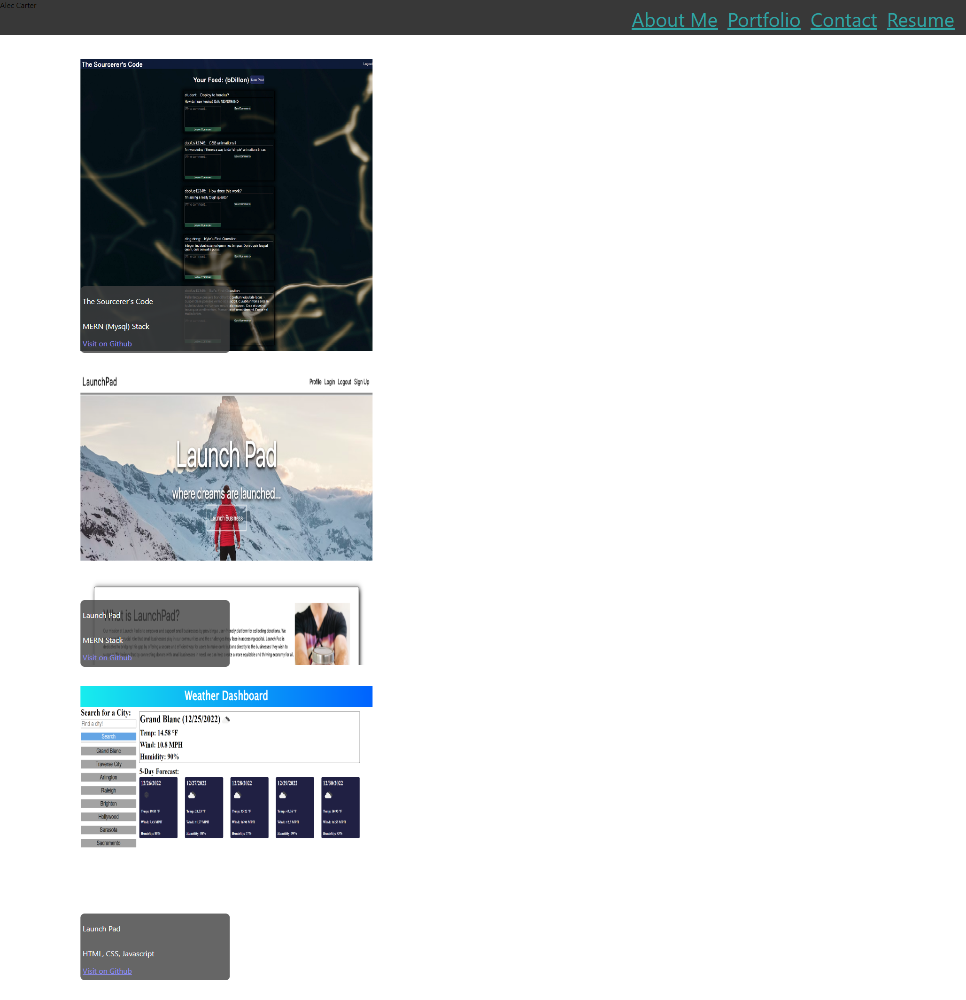

# React Portfolio

- [Description](#Description)
- [Installation](#Installation)
- [Usage](#Usage)
- [Contribution](#Contribution)
- [Testing](#Testing)
- [License](#License)
- [Github](#Github)

## Description
This is an incomplete personal portfolio made with react.js

## Installation
N/A

## Usage
N/A

## Contribution
N/A

## Testing
N/A

## License 
https://opensource.org/licenses/MIT

## Github
acarter867

## Email
acarter867@icloud.com

## Preview

